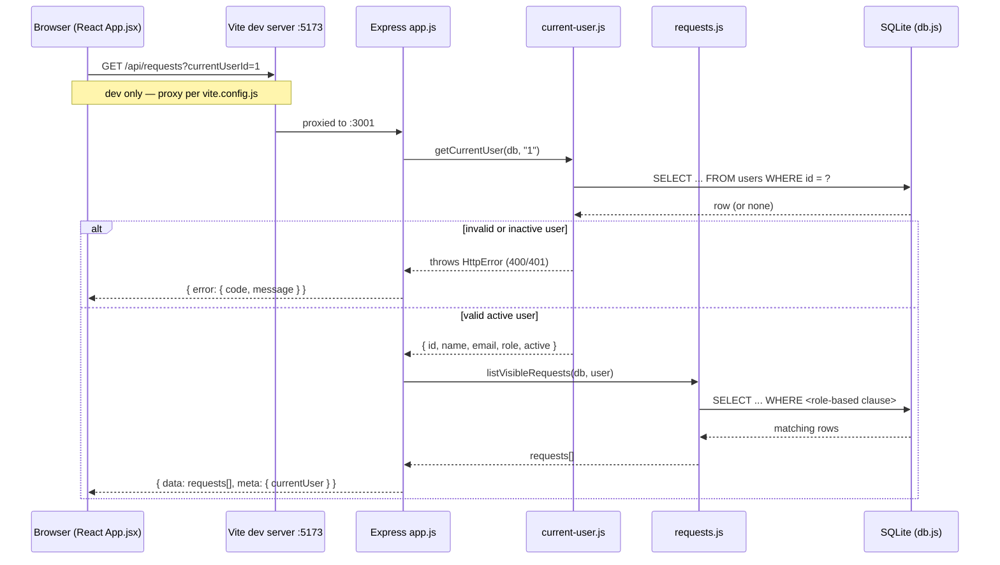

# Internal Request Hub — Architecture Guide

This guide describes how the application is actually built today,
verified against the code. It uses the same labeling convention as
[`docs/domain.md`](domain.md):

- **Confirmed** — directly verified against the code, with the file and
  function/line cited.
- **Inference** — a reasonable reading of the evidence, not stated
  outright anywhere.
- **Open question** — something unresolved that a reviewer should
  decide; the code doesn't answer it either way.

Current architecture is described first. Recommendations are kept in
their own section at the end and are clearly separated from the
"what exists today" material above them.

---

## 1. Stack

**Confirmed.**

| Layer | Technology | Evidence |
|---|---|---|
| Frontend | React 19 + Vite 7 | `client/package.json`: `react@19.1.1`, `vite@7.1.3`, `@vitejs/plugin-react` |
| Backend | Express 5 (ESM) | `server/package.json`: `express@5.1.0`, `"type": "module"` |
| Database | SQLite via Node's built-in `node:sqlite` | `server/src/db.js:3`, `import { DatabaseSync } from "node:sqlite"` |
| Server tests | Node's built-in test runner | `server/package.json` `"test": "node --test"`; `server/test/app.test.js` uses `node:test` / `node:assert/strict` |
| Client tests | Vitest + Testing Library + jsdom | `client/package.json` (`vitest`, `@testing-library/react`, `jsdom`); `client/vite.config.js:12-15` (`test.environment: "jsdom"`) |
| Lint | ESLint 9, flat config | `server/eslint.config.js`, `client/eslint.config.js` |
| Process orchestration | npm workspaces + `concurrently` | root `package.json:5` (`"workspaces": ["client", "server"]`), `"dev"` script |
| CI | GitHub Actions | `.github/workflows/ci.yml` |

**Confirmed.** `node:sqlite`'s `DatabaseSync` is a built-in Node API —
there is no SQLite driver dependency (no `better-sqlite3`, no
`sqlite3`) in `server/package.json`. This matches the course's
"no native module install needed" claim in `CLAUDE.md`.

**Confirmed.** `engines.node` in the root `package.json:17-19` requires
Node `>=22`, and CI pins `node-version: 22` (`.github/workflows/ci.yml`).

---

## 2. Repository structure

**Confirmed.** Two npm workspaces under one root:

```
├── package.json              # workspace root: dev/build/test/lint/db:reset scripts
├── server/                   # Express API
│   ├── package.json
│   ├── src/
│   │   ├── index.js          # process entry point
│   │   ├── app.js            # createApp({ db }) — routes + middleware
│   │   ├── db.js             # schema, seed data, createDatabase()
│   │   ├── requests.js       # visibility rules + request queries
│   │   ├── current-user.js   # simulated-identity resolution
│   │   ├── http-errors.js    # HttpError, errorResponse()
│   │   └── reset-db.js       # db:reset script entry point
│   ├── test/app.test.js      # exercises real SQLite via an in-memory db
│   └── data/request-hub.db*  # SQLite file + WAL/SHM, created at runtime
├── client/                   # React SPA
│   ├── package.json
│   ├── vite.config.js        # dev proxy + vitest config
│   └── src/
│       ├── main.jsx          # ReactDOM root
│       ├── App.jsx           # top-level state + data loading
│       ├── api.js            # fetch wrappers
│       ├── components/       # UserSwitcher, RequestList, RequestDetails, StatusBadge
│       └── App.test.jsx      # mocks `fetch`, renders <App/>
└── .github/workflows/ci.yml  # npm ci → lint → test → build
```

**Confirmed.** `client/dist` (the Vite build output) is not checked in —
it's produced by `npm run build` and only referenced at runtime by the
server (see §5).

---

## 3. Request flow: one call traced end to end

This traces `GET /api/requests` (the request-list call); the
single-request call `GET /api/requests/:id` follows the same path
through one additional step (`getVisibleRequest` instead of
`listVisibleRequests`), noted inline.

**Confirmed, step by step:**

1. **Client triggers the load.** `client/src/App.jsx:29-38` — a
   `useEffect` that fires whenever `currentUserId` changes calls
   `loadRequests(currentUserId)`.
2. **Client builds the HTTP call.** `client/src/api.js:14-16` —
   `loadRequests` calls `requestJson(`/api/requests?currentUserId=${currentUserId}`)`,
   which does a plain `fetch` and unwraps `{ data }` from the JSON body,
   or throws using `body.error.message` if `response.ok` is false
   (`client/src/api.js:1-8`).
3. **In development, Vite proxies the call.** `client/vite.config.js:6-10` —
   requests to `/api/*` from the Vite dev server (port 5173) are
   proxied to `http://localhost:3001`, where the Express server runs.
   (In production there is no proxy — see §5.)
4. **Express receives the call.** `server/src/app.js:39-46` — the
   `GET /api/requests` handler reads `request.query.currentUserId`.
5. **Identity is resolved and validated.** `server/src/current-user.js:3-20` —
   `getCurrentUser(db, rawUserId)` coerces the query param to an
   integer, throws `HttpError(400, "CURRENT_USER_REQUIRED", …)` if it
   isn't one, looks the user up by id, and throws
   `HttpError(401, "INVALID_CURRENT_USER", …)` if no matching **active**
   user exists. On success it returns `{ id, name, email, role, active: true }`.
6. **Visibility is applied in SQL.** `server/src/requests.js:25-32` —
   `listVisibleRequests(db, user)` calls `visibilityClause(user)`
   (`server/src/requests.js:56-62`), which returns a `WHERE` fragment
   and bound params based on `user.role`:
   - `admin` → `"1 = 1"` (no restriction)
   - `reviewer` → `"r.assigned_reviewer_id = ?"` bound to `user.id`
   - anything else (`employee`) → `"r.requester_id = ?"` bound to `user.id`

   That fragment is spliced into the shared `requestSelect` query
   (`server/src/requests.js:3-23`, a join across `requests`,
   `categories`, and `users` twice — once as `requester`, once as
   `reviewer`), ordered by `created_at DESC, id DESC`.

   *(For `GET /api/requests/:id`, the equivalent step is
   `getVisibleRequest` at `server/src/requests.js:34-54`: it fetches the
   row by id first, returns 404 if missing, then checks
   `user.role === "admin" || (employee && requesterId === user.id) || (reviewer && assignedReviewerId === user.id)`
   and returns 403 if the check fails — authorization happens
   **after** the row is fetched, in application code, not in the SQL
   `WHERE` clause.)*
7. **Express responds.** `server/src/app.js:42` —
   `response.json({ data: listVisibleRequests(db, user), meta: { currentUser: user } })`.
8. **Errors are centralized.** If any step throws (steps 5 or 6 for the
   single-request case), the route handler's `catch` calls `next(error)`
   (`server/src/app.js:43-45`), which reaches the single error
   middleware at `server/src/app.js:64-74`. It special-cases JSON parse
   `SyntaxError`, otherwise reads `error.status` (falling back to 500,
   logging to `console.error` for 5xx), and always responds with
   `errorResponse(error)` (`server/src/http-errors.js:9-16`) —
   `{ error: { code, message } }`.
9. **Client renders the result.** Back in `App.jsx`, the resolved
   promise sets `requests` state (or `error` state on throw), which
   `RequestList` (`client/src/components/RequestList.jsx`) renders as
   cards; selecting one calls `openRequest`, which repeats steps 2–8 for
   `GET /api/requests/:id` and renders the result via `RequestDetails`.

### Flow diagram



**Confirmed.** This diagram matches the handler at
`server/src/app.js:39-46`, `getCurrentUser` at
`server/src/current-user.js:3-20`, and `listVisibleRequests` /
`visibilityClause` at `server/src/requests.js:25-32,56-62`.

---

## 4. Responsibility boundaries

**Confirmed.** Each server module has one clearly scoped job, and the
boundary is observable, not just conventional:

- `db.js` — **only** schema definition (`migrate`), seed data
  (`seed`), and connection creation (`createDatabase`). It has no
  knowledge of HTTP or authorization.
- `current-user.js` — **only** resolves and validates "who is making
  this call," given a raw id. It doesn't know about requests or
  visibility.
- `requests.js` — **only** visibility rules and request queries. It
  takes an already-resolved `user` object; it does not itself talk to
  `current-user.js`.
- `http-errors.js` — **only** the shared error shape (`HttpError`,
  `errorResponse`). Used by both `current-user.js` and `requests.js`,
  consumed by `app.js`.
- `app.js` — **only** wiring: routes call the above modules in order
  and forward failures to one error-handling middleware
  (`server/src/app.js:64-74`). It contains no SQL and no visibility
  logic itself.
- `index.js` — **only** process concerns: reading env vars
  (`PORT`, `DB_FILE`), starting the HTTP listener, and shutdown on
  `SIGINT`/`SIGTERM` (`server/src/index.js:4-20`).

**Confirmed.** The client mirrors this separation: `api.js` is the only
module that calls `fetch`; `App.jsx` holds all top-level state and
decides *when* to load data; the components under `components/` are
presentational and receive data/callbacks as props (none of them import
`api.js` directly — confirmed by inspecting their imports, which are
limited to `StatusBadge.jsx` and prop types).

**Inference.** This split (db / identity / domain-query / error-shape /
wiring, each as its own file) reads as a deliberate teaching structure
for the course rather than an incidental organization — it's small
enough that a single file would have worked, so the separation looks
intentional.

---

## 5. Identity and access enforcement

**Confirmed.** There is no authentication. The client sends a plain
`currentUserId` value as a query string parameter on every request
(`client/src/api.js:14,18`); there is no session, cookie, token, or
header involved anywhere in `client/src/api.js` or `server/src/app.js`.

**Confirmed.** Enforcement happens **only** on the server, in two
layers, both of which must pass for any data to be returned:
1. **Identity validity** (`current-user.js`): the id must resolve to an
   existing, active user, or the call is rejected before any request
   data is touched.
2. **Row-level visibility** (`requests.js`): applied either as a SQL
   `WHERE` clause for the list endpoint, or as a post-fetch boolean
   check for the single-record endpoint (see §3, step 6). Both are
   driven by `user.role` and `user.id`, never by anything the client
   asserts about itself beyond the raw id.

**Confirmed.** The client holds no enforcement logic of its own — it
never filters requests by role or id in `App.jsx`, `RequestList.jsx`,
or `RequestDetails.jsx`; it only renders whatever the server already
decided to return. This matches the "never rely on the UI hiding
something" boundary stated in `CLAUDE.md`.

**Open question.** Because authorization for a single request
(`getVisibleRequest`) happens *after* the row is fetched by id alone
(no `WHERE requester_id = ? OR assigned_reviewer_id = ?` filtering at
the SQL layer), every detail lookup reads one full row from the
database before deciding whether to return it. At current data volumes
this is immaterial, but it's worth knowing if row sizes or request
volume grow — whether to push that filter into SQL is a design choice,
not a bug.

---

## 6. Database lifecycle

**Confirmed.** `createDatabase(filename)` (`server/src/db.js:9-20`) is
the single entry point for getting a working database handle, and it
always does three things in order:
1. Opens the file with `DatabaseSync` (or `:memory:` if that literal
   string is passed).
2. Runs `migrate(db)` (`server/src/db.js:22-55`) — `CREATE TABLE IF NOT
   EXISTS` for `users`, `categories`, `requests`, plus three indexes.
   This is idempotent and safe to call against an existing database.
3. Runs `seed(db)` (`server/src/db.js:57-101`) — but only if the
   `users` table is currently empty (`SELECT COUNT(*) ... ; if (count >
   0) return;`). So seeding happens at most once per database file.

**Confirmed.** Three distinct ways this gets invoked:
- **Normal startup**: `index.js:5` calls
  `createDatabase(process.env.DB_FILE)` — if `DB_FILE` is unset, this
  resolves to `undefined`, which triggers `db.js`'s default parameter
  (`defaultDatabasePath`, resolving to `server/data/request-hub.db`).
  The directory is created if missing (`fs.mkdirSync(..., {recursive:
  true})`, `db.js:11`), and `PRAGMA journal_mode = WAL` is set for any
  on-disk file (`db.js:16`), so the data directory accumulates
  `request-hub.db`, `-wal`, and `-shm` files, confirmed present in
  `server/data/`.
- **Tests**: `server/test/app.test.js:10` calls
  `createDatabase(":memory:")` — a fresh, unseeded-by-reuse database
  per test run, discarded on close (`after(() => db.close())`).
- **Manual reset**: `server/src/reset-db.js` deletes the on-disk file
  and its `-shm`/`-wal` siblings, then calls `createDatabase()` with no
  argument (defaulting to the same on-disk path), which re-triggers
  seeding since the file is gone and the new one starts empty.

**Confirmed.** There is no migration *framework* — "migrate" here means
only "create tables if they don't already exist." There is no
versioning of schema changes, no `ALTER TABLE` path, and no way to
evolve the schema on an existing database without `db:reset` or a code
change to `migrate()` plus manual `ALTER` statements. This matches
`CLAUDE.md`'s description, which never mentions migrations beyond
initial creation.

---

## 7. Development vs. production serving

**Confirmed — development.** `npm run dev` (root `package.json:7`) runs
two processes concurrently via `concurrently`:
- `node --watch src/index.js` for the API, on port 3001 (hardcoded
  default in `index.js:4`, overridable via `PORT`).
- `vite` for the client dev server, on port 5173
  (`client/vite.config.js:6-7`), which proxies `/api/*` to
  `http://localhost:3001` (`client/vite.config.js:8-10`).

Two separate processes, two separate ports, joined only by the proxy.

**Confirmed — production.** `npm run build` runs `vite build` in the
client workspace only (root `package.json:8`), producing
`client/dist`. `npm start` runs only the server
(`node server/src/index.js`, via root `package.json:9`). In
`server/src/app.js:10-11,57-62`:
```js
const clientDist = path.resolve(currentDir, "../../client/dist");
...
if (fs.existsSync(clientDist)) {
  app.use(express.static(clientDist));
  app.get("/{*path}", (_request, response) => {
    response.sendFile(path.join(clientDist, "index.html"));
  });
}
```
So in production there is **one process, one port** — Express serves
the built static client *and* the `/api/*` routes together, with a
catch-all that returns `index.html` for any non-API path (enabling
client-side routing, though the current client has no router). If
`client/dist` doesn't exist, that static-serving branch is simply
skipped — the API still runs, just without a client being served.

**Confirmed.** This matches the README's instruction to verify a
change with `npm run build && npm start` rather than `npm run dev` —
`npm run dev` never exercises the static-serving path at all, since
`client/dist` isn't built in that mode.

---

## 8. Verification commands (as actually defined, not assumed)

**Confirmed**, each pulled directly from the relevant `package.json`:

| Command (run from repo root) | What it does | Source |
|---|---|---|
| `npm ci` | Installs all workspace dependencies | root scripts N/A — standard npm behavior with `workspaces` |
| `npm run dev` | Starts API (`:3001`, watch mode) + client dev server (`:5173`) concurrently | root `package.json:7` |
| `npm test` | Runs `node --test` in `server/`, then `vitest run` in `client/`, sequentially (`&&`) | root `package.json:10`; `server/package.json:8`; `client/package.json:9` |
| `npm run lint` | Runs ESLint in `server/`, then `client/`, sequentially | root `package.json:11` |
| `npm run build` | Runs `vite build` in `client/` only | root `package.json:8` |
| `npm start` | Runs `node src/index.js` in `server/` only | root `package.json:9` |
| `npm run db:reset` | Deletes `server/data/request-hub.db*` and recreates + reseeds it | root `package.json:12`; `server/src/reset-db.js` |
| `node --test server/test/app.test.js` (from repo root) or `node --test` (from `server/`) | Runs the single server test file directly | matches `server/package.json` test script |
| `npx vitest run src/App.test.jsx` (from `client/`) | Runs the single client test file directly | matches `client/package.json` test script |

**Confirmed.** CI (`.github/workflows/ci.yml`) runs, on every pull
request and on pushes to `main`/`audience-starter`: `npm ci` →
`npm run lint` → `npm test` → `npm run build`, in that order, on
`ubuntu-latest` with Node 22. It does **not** run `npm start` or any
deployment step — there is no hosted deployment, matching the README's
explicit statement to that effect.

**Confirmed.** `GET /api/health` (`server/src/app.js:18-20`) returns
`{ status: "ok" }` unconditionally — it does not check database
connectivity or any dependency; it only confirms the Express process is
up and routing.

---

## 9. Recommendations (separate from the above — not yet implemented, not decided)

These are suggestions prompted by gaps surfaced above. None of them
reflect current behavior, and none have been acted on.

- **Push single-record authorization into the query.** Since
  `getVisibleRequest` (`server/src/requests.js:34-54`) fetches by id
  first and checks authorization after, consider folding the same
  `visibilityClause` used for the list endpoint into the single-record
  query (with an `OR id = ?` or similar), so an unauthorized row is
  never read at all rather than read-then-rejected. Worth doing only
  if row volume or sensitivity grows enough to matter.
- **Document the `DB_FILE`/`PORT` env vars in one place.** They're
  read in `index.js:4-5` but not mentioned in `README.md` or
  `CLAUDE.md` beyond a passing reference — a short "Configuration"
  section would help anyone running this outside the default dev
  setup.
- **Consider a lightweight schema-migration convention** before any
  schema change ships beyond the initial `CREATE TABLE IF NOT EXISTS`
  set, since there's currently no path for altering an existing
  on-disk database other than `db:reset` (which discards all data) or
  hand-written `ALTER TABLE` statements layered into `migrate()`.
- **Clarify the intended behavior of `GET /api/health` under failure.**
  Right now it can't fail (it does no work beyond responding), so it
  can't distinguish "process is up" from "process is up and the
  database is reachable." Decide if that distinction matters for this
  project before building anything that depends on it.

---

*This document reflects the codebase as of the files cited above. It
should be revisited whenever the architecture changes materially —
in particular, anything that adds routes, changes the identity model,
or introduces a schema-migration mechanism.*
